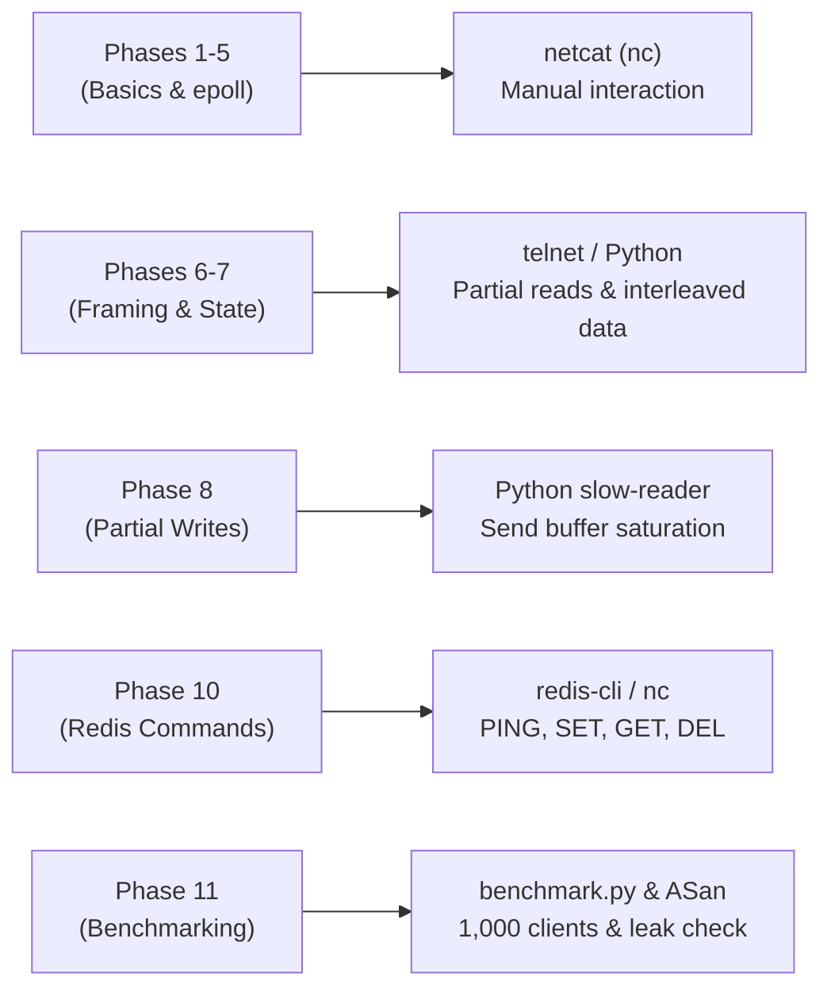

# 🚀 Production-Grade Event-Driven C++ Redis-Compatible Engine
### *A Zero-to-Completion Systems Programming Roadmap for High-Tier / MAANG C++ Roles*

---

## 🎯 What Makes This Project Resume-Defining for MAANG & Quant Firms?
Most applicants show up with a generic web server or an academic toy project. High-tier engineering firms (Google, Meta, Bloomberg, Amazon, Cloudflare, Citadel) look for engineers who understand:
1. **Low-Level Linux Systems Programming:** Direct POSIX syscalls (`fcntl`, `epoll`, `read`/`write`), file descriptor tables, and OS socket buffers.
2. **Event-Driven Asynchronous Architecture:** A single-threaded event loop scaling to 10,000+ concurrent connections at sub-millisecond p99 latency without threads or locks.
3. **Modern C++ Idioms (C++17):** Zero-copy parsing with `std::string_view`, RAII wrappers around OS resources (`UniqueFd`), memory sanitizers (ASan/UBSan), and clean decoupling.
4. **Real Protocol Implementation:** Implementing a subset of the actual **Redis Protocol (RESP)** (`PING`, `SET`, `GET`, `DEL`) with an in-memory key-value store.
5. **Measurable Benchmarks:** Hard metrics you can put on your resume (e.g., *"Achieved 85,000+ QPS with sub-millisecond p99 latency"*).

---

## Table of Contents
1. [Project Dependency Graph](#1-project-dependency-graph)
2. [Prerequisites Classification](#2-prerequisites-classification)
3. [Minimal Theory vs. Rabbit Hole Boundaries](#3-minimal-theory-vs-rabbit-hole-boundaries)
4. [The Core Conceptual Chains](#4-the-core-conceptual-chains)
5. [The Phased Implementation Roadmap (Incremental Evolution of `server.cpp`)](#5-the-phased-implementation-roadmap)
   - [Phase 1: Foundations of Linux I/O](#phase-1-foundations-of-linux-io)
   - [Phase 2: The Simplest TCP Connection](#phase-2-the-simplest-tcp-connection)
   - [Phase 3: The Multi-Client Blocking Trap](#phase-3-the-multi-client-blocking-trap)
   - [Phase 4: Non-Blocking Sockets & The 100% CPU Busy-Loop](#phase-4-non-blocking-sockets--the-100-cpu-busy-loop)
   - [Phase 5: The `epoll` Event Loop (Concurrency at 0% Idle CPU)](#phase-5-the-epoll-event-loop-concurrency-at-0-idle-cpu)
   - [Phase 6: TCP Stream Semantics & Application Message Framing](#phase-6-tcp-stream-semantics--application-message-framing)
   - [Phase 7: Per-Client State Isolation](#phase-7-per-client-state-isolation)
   - [Phase 8: Partial Writes, Outgoing Buffers & `EPOLLOUT`](#phase-8-partial-writes-outgoing-buffers--epollout)
   - [Phase 9: Robust Connection Cleanup & The `SIGPIPE` Trap](#phase-9-robust-connection-cleanup--the-sigpipe-trap)
   - [Phase 10: Zero-Copy Modular Engine (`std::string_view` & Redis Protocol)](#phase-10-zero-copy-modular-engine-stdstring_view--redis-protocol)
   - [Phase 11: Production Hardening, Sanitizers (ASan) & Benchmarking](#phase-11-production-hardening-sanitizers-asan--benchmarking)
6. [Testing Roadmap & Tool Progression](#6-testing-roadmap--tool-progression)
7. [Difficulty Progression & Conceptual Jumps](#7-difficulty-progression--conceptual-jumps)
8. [Resume Bullets & MAANG Technical Interview Prep](#8-resume-bullets--maang-technical-interview-prep)
9. [Final Mastery Checklist](#9-final-mastery-checklist)

---

## 1. Project Dependency Graph

```mermaid
flowchart TD
    cb["C++ Memory Model & RAII"] --> fd["Linux File Descriptors & POSIX I/O"]
    fd --> bio["Blocking Network I/O"]
    bio --> tcp["IPv4 & TCP Socket Lifecycle"]
    tcp --> v1["Phase 2: Single-Client Echo"]
    v1 --> v2["Phase 3: Multi-Client Blocking Trap"]
    v2 --> nbio["Non-Blocking I/O & EAGAIN"]
    nbio --> v3["Phase 4: Busy-Wait Polling (100% CPU)"]
    v3 --> epoll["OS Event Notification (epoll)"]
    epoll --> v4["Phase 5: epoll Event Loop"]
    v4 --> stream["TCP Stream Semantics (Packets vs Streams)"]
    stream --> framing["Application-Level Message Framing"]
    framing --> v5["Phase 6: Accumulation & Message Slicing"]
    v5 --> v6["Phase 7: Per-Client Read State (Isolated Buffers)"]
    v6 --> pwrite["Partial Writes & OS Send Buffers"]
    pwrite --> v7["Phase 8: Outgoing Buffers & EPOLLOUT"]
    v7 --> teardown["Connection Teardown & Lifecycle Cleanup"]
    teardown --> v8["Phase 9: Robust Error & Disconnect Handling"]
    v8 --> arch["Phase 10: Zero-Copy Redis Protocol (std::string_view)"]
    arch --> stress["Phase 11: ASan, DoS Caps & 1,000-Client Benchmarking"]
    stress --> prod["Production-Grade Engine Ready for Resume"]
```



---

## 2. Prerequisites Classification

### 🔴 Tier 1: MUST KNOW BEFORE STARTING
* **C++ Fundamentals:** Variables, loops, functions, basic classes/structs.
* **Pointers & Memory:** Stack vs. heap, pointers, references, memory addresses, byte arrays (`char[]` / `uint8_t[]`).
* **Basic C++ Containers:** `std::string`, `std::vector`, `std::unordered_map`.
* **Basic Linux CLI:** Navigating directories (`cd`, `ls`), compiling with `g++ -std=c++17 -Wall -Wextra`.

### 🟡 Tier 2: LEARN JUST BEFORE WE NEED IT (Covered inside each phase)
* **File Descriptors (FDs):** *Phase 1*
* **Low-Level POSIX System Calls (`read`, `write`):** *Phase 1*
* **IPv4 Addresses, Ports, Network Byte Order (`sockaddr_in`, `htons`):** *Phase 2*
* **Socket Lifecycle (`socket`, `bind`, `listen`, `accept`):** *Phase 2*
* **Blocking vs. Non-blocking & `errno` (`fcntl`, `O_NONBLOCK`, `EAGAIN`):** *Phase 4*
* **OS Event Demultiplexing (`epoll_create1`, `epoll_ctl`, `epoll_wait`):** *Phase 5*
* **Stream Semantics vs. Packet Boundaries:** *Phase 6*
* **Application Message Framing (Delimiters, Length prefixes):** *Phase 6*
* **Connection State Management:** *Phase 7*
* **Write Readiness & `EPOLLOUT`:** *Phase 8*
* **Connection Teardown (EOF, RST, `close`, `SIGPIPE`):** *Phase 9*
* **Zero-Copy Parsing with `std::string_view`:** *Phase 10*
* **AddressSanitizer (ASan) & Benchmarking:** *Phase 11*

### 🟢 Tier 3: OPTIONAL / POSTPONE ("DO NOT LEARN YET")
Do **not** research these until this entire project is finished:
* **`io_uring`, `kqueue`, Windows IOCP:** `epoll` is the industry standard on Linux (used by Nginx, Node.js, Redis). Master `epoll` first.
* **Multi-threading / Thread Pools / Mutexes:** A single-threaded event loop can handle 50,000+ connections effortlessly. Adding threads now will introduce race conditions and deadlocks that distract from networking.
* **DPDK / Kernel Bypass / Custom TCP stacks:** Hardware-level optimizations for HFT. Not needed for socket programming.
* **Raw Packets (`SOCK_RAW`) / PCAP:** For firewalls and Wireshark, not servers.
* **TLS / SSL Internals:** Plaintext byte streams must be mastered first.
* **HTTP/1.1, HTTP/2, HTTP/3:** Far more verbose than needed. Building a Redis-compatible command parser gives 10x better systems interview talking points.

---

## 3. Minimal Theory vs. Rabbit Hole Boundaries

| Topic | What You MUST Understand | What is a RABBIT HOLE (Ignore) |
| :--- | :--- | :--- |
| **TCP** | Connection-oriented, reliable, ordered **byte stream** (no packet boundaries). Handshake exists; disconnects send FIN/RST. | Sliding window math, Congestion Control algorithms (Cubic, BBR), TCP packet header bit-fields, MTU discovery. |
| **Linux I/O** | Everything is an integer File Descriptor (FD). `read()` and `write()` copy bytes between kernel buffers and user memory. | Virtual File System (VFS) kernel source code, inode structures, disk storage drivers. |
| **Non-blocking I/O** | Syscall returns immediately. If no data/buffer space is available, it returns `-1` and sets `errno = EAGAIN`. | Signal-driven I/O (`SIGIO`), POSIX AIO (`aio_read`). |
| **epoll** | The kernel monitors a set of FDs and notifies you which ones are ready. Level-Triggered (LT) mode. | Edge-Triggered (ET) race conditions, kernel Red-Black tree implementation details. |
| **C++ Architecture** | RAII for socket closing, `std::string_view` for zero-copy parsing, separating headers and implementation. | Template metaprogramming, complex inheritance hierarchies, custom memory allocators. |

---

## 4. The Core Conceptual Chains

### Chain 1: The Concurrency Chain
$$\text{blocking } \texttt{accept()}/\texttt{read()}/\texttt{write()}$$
$$\downarrow$$
$$\text{one slow client freezes the entire server for all other clients}$$
$$\downarrow$$
$$\text{non-blocking I/O } (\texttt{O\_NONBLOCK})$$
$$\downarrow$$
$$\text{polling every socket in a loop burns 100\% CPU (busy-waiting)}$$
$$\downarrow$$
$$\text{kernel-level event notification } (\texttt{epoll})$$
$$\downarrow$$
$$\text{one single-threaded event loop efficiently serving thousands of connections}$$

---

### Chain 2: The Data Stream Chain
$$\text{TCP is a byte stream (not a message protocol)}$$
$$\downarrow$$
$$\texttt{read()} \text{ does not correspond to application messages}$$
$$\downarrow$$
$$\text{messages can arrive split across multiple reads OR lumped together in one read}$$
$$\downarrow$$
$$\text{need application-level framing (e.g. delimiter like } \texttt{\textbackslash n} \text{)}$$
$$\downarrow$$
$$\text{per-client read buffer to accumulate fragments}$$
$$\downarrow$$
$$\text{message slicing: extract complete queries, preserve remainder in buffer}$$

---

### Chain 3: The Write Readiness Chain
$$\texttt{write()} \text{ to a non-blocking socket}$$
$$\downarrow$$
$$\text{kernel socket send buffer fills up}$$
$$\downarrow$$
$$\texttt{write()} \text{ writes fewer bytes than requested (partial write) or returns } \texttt{EAGAIN}$$
$$\downarrow$$
$$\text{must queue remaining bytes in a per-client write buffer}$$
$$\downarrow$$
$$\text{register } \texttt{EPOLLOUT} \text{ with epoll to wake us when kernel buffer has space}$$
$$\downarrow$$
$$\text{flush buffer upon } \texttt{EPOLLOUT} \text{ and immediately remove } \texttt{EPOLLOUT} \text{ when empty}$$

---

## 5. The Phased Implementation Roadmap

Instead of maintaining a dozen disconnected files, we will build and evolve **one continuous project**. Starting with Phase 2, we will create `server.cpp` and incrementally transform it at every phase.

---

### Phase 1: Foundations of Linux I/O
> **Curated Study References:**
> - 📄 **[Reading 1 - Web Guide]:** [Beej's Guide to Network Programming - Section 2.1: "What is a socket?"](https://beej.us/guide/bgnet/html/#what-is-a-socket) (Explains how Linux treats sockets as file descriptors).
> - 📄 **[Reading 2 - Linux Man Page]:** [man7.org: read(2)](https://man7.org/linux/man-pages/man2/read.2.html) & [man7.org: write(2)](https://man7.org/linux/man-pages/man2/write.2.html) (Pay attention to RETURN VALUE).
> - 🎥 **[Video 1 - YouTube]:** [Jacob Sorber: "File Descriptors Explained in C / Linux"](https://www.youtube.com/watch?v=KM5sRWAYqaw) | [Search Backup](https://www.youtube.com/results?search_query=Jacob+Sorber+File+Descriptors) (Concise breakdown of integer FDs).

#### 🎯 Goal
Understand that in Linux, *everything is a file descriptor*. Sockets are not magical objects; they are integer file descriptors you `read()` and `write()` like any terminal or file.

#### 📖 What to Learn
* An integer File Descriptor (FD) indexes the kernel's open-file table for your process.
* Standard FDs: `0` (stdin), `1` (stdout), `2` (stderr).
* `read()` and `write()` do not understand strings or null terminators (`\0`). They only deal with raw byte buffers.
* Return values of `read()`: `>0` (bytes read), `0` (EOF), `-1` (error).

#### 💻 What to Implement (`stage0_io.cpp`)
* **Task:** Create a standalone test program `stage0_io.cpp`.
* Read from FD `0` into `char buffer[128]`.
* Write the received bytes out to FD `1`.
* If `read()` returns `0`, print an EOF message and exit the loop.

#### 🧪 Experiments & Verification
```bash
g++ -Wall -Wextra -std=c++17 stage0_io.cpp -o stage0_io
./stage0_io
# Type something and press Enter. It echoes back!
# Press Ctrl+D (sends EOF). Program exits cleanly.
echo "Piped text" | ./stage0_io
```

#### ⚠️ Common Traps
* Printing `buffer` with `std::cout << buffer;` without null-terminating it.
* Passing `sizeof(buffer)` to `write()` instead of the actual number of bytes returned by `read()`.

#### ✅ Exit Criteria
* You can explain what an FD is and what `read()` returns on data, EOF, and error.

---

### Phase 2: The Simplest TCP Connection
> **Curated Study References:**
> - 📄 **[Reading 1 - Web Guide]:** [Beej's Guide - Section 3: IP Addresses, Structs, and Data Munging](https://beej.us/guide/bgnet/html/#ip-addresses-structs-and-data-munging) & [Section 5: System Calls or Bust](https://beej.us/guide/bgnet/html/#system-calls-or-bust) (Sections 5.1 to 5.4).
> - 📄 **[Reading 2 - Linux Man Pages]:** [man7.org: socket(2)](https://man7.org/linux/man-pages/man2/socket.2.html), [man7.org: bind(2)](https://man7.org/linux/man-pages/man2/bind.2.html), [man7.org: listen(2)](https://man7.org/linux/man-pages/man2/listen.2.html), [man7.org: accept(2)](https://man7.org/linux/man-pages/man2/accept.2.html).
> - 🎥 **[Video 1 - YouTube]:** [Jacob Sorber: "Program Your Own Web Server in C (Sockets)"](https://www.youtube.com/watch?v=esXw4bdaZkc) | [Search Backup](https://www.youtube.com/results?search_query=Jacob+Sorber+Socket+Programming+in+C) (Step-by-step breakdown of `socket()`, `bind()`, `listen()`, `accept()`).
> - 🎥 **[Video 2 - YouTube]:** [Computerphile: "Network Layers Model (Networking Basics)"](https://www.youtube.com/watch?v=eelvWAURfdI) | [Search Backup](https://www.youtube.com/results?search_query=Computerphile+Networking+Basics).

#### 🎯 Goal
Create your official project file `server.cpp`. Establish a real TCP network connection over IPv4 and echo data back to a single client.

#### 📖 What to Learn
* IPv4 addressing (`127.0.0.1`) and 16-bit port numbers.
* Host Byte Order (Little-Endian) vs. Network Byte Order (Big-Endian) $\to$ why `htons()` is required.
* The listening socket lifecycle: `socket() -> bind() -> listen() -> accept()`.
* Why `accept()` returns a **new FD** representing the client connection.

#### 💻 What to Implement (`server.cpp`)
* **What we are building:** Create `server.cpp`.
* Create an IPv4 TCP socket: `int listen_fd = socket(AF_INET, SOCK_STREAM, 0);`.
* Configure socket options: `setsockopt(..., SO_REUSEADDR, ...)`.
* Fill out `struct sockaddr_in` with `INADDR_ANY` and `htons(8080)`.
* Call `bind()` and `listen()`.
* Call `accept()` once: `int client_fd = accept(listen_fd, ...);`.
* Read from `client_fd` into a buffer, write it back to `client_fd`, then `close(client_fd)` and `close(listen_fd)`.

#### 🧪 Experiments & Verification
```bash
g++ -Wall -Wextra -std=c++17 server.cpp -o server
./server
# In another terminal:
nc 127.0.0.1 8080
# Type "hello" and hit Enter. You receive "hello" back, and the server exits!
```

#### ⚠️ Common Traps
* Forgetting `htons(8080)` (port number gets flipped in bytes).
* Not checking return values of `bind()` (fails with error if port is already in use).

#### ✅ Exit Criteria
* You can write out the sequence of socket syscalls from memory and explain why `accept()` returns a new FD.

---

### Phase 3: The Multi-Client Blocking Trap
> **Curated Study References:**
> - 📄 **[Reading 1 - Web Guide]:** [Beej's Guide - Section 5.4: accept()](https://beej.us/guide/bgnet/html/#accept) (Explains how accept waits for connections).
> - 📄 **[Reading 2 - Linux Diagnostics]:** [man7.org: strace(1)](https://man7.org/linux/man-pages/man1/strace.1.html) (The ultimate tool to inspect syscall execution).
> - 🎥 **[Video 1 - YouTube]:** [Jacob Sorber: "How One Thread Listens to Many Sockets (select/blocking)"](https://www.youtube.com/watch?v=Y6pFtgRdUts) | [Search Backup](https://www.youtube.com/results?search_query=Jacob+Sorber+Multiple+Sockets).

#### 🎯 Goal
Expose the fatal flaw of blocking network I/O when handling multiple clients.

#### 📖 What to Learn
* Blocking behavior: when `accept()` or `read()` has no data available, the Linux kernel puts your thread to sleep.
* Head-of-line blocking: if your single thread is asleep waiting for Client 1 to send data, Client 2 cannot even complete `accept()`.

#### 💻 What to Change in `server.cpp`
* **In the previous phase:** Our server handled one client and immediately exited.
* **Now, we change `server.cpp` to:**
  - Wrap the connection handling in an outer `while (true)` loop so the server stays alive.
  - Inside the outer loop, call `accept()`.
  - Once accepted, enter an inner `while (true)` loop that repeatedly calls `read()` and echoes back to that client until the client disconnects (`read() == 0`).
  - Then close that client and loop back to accept the next one.

#### 🧪 Experiments & Verification
1. Start `./server`.
2. Terminal 1: Run `nc 127.0.0.1 8080` (do NOT type anything; leave it open).
3. Terminal 2: Run `nc 127.0.0.1 8080`. Type `hello` and press Enter.
4. **Observe:** Terminal 2 hangs completely and gets no response!
5. In Terminal 3, run: `strace -p $(pgrep server)` $\to$ you will see the server process is frozen on `read(client_1_fd, ...)`.
6. Press `Ctrl+C` in Terminal 1. Terminal 2 suddenly unfreezes and receives its echo!

#### ⚠️ Common Traps
* Assuming this is a bug in TCP. It is not; it is because our server code runs synchronously on a single thread.

#### ✅ Exit Criteria
* You can explain precisely which line of code freezes the server when Client 1 stays idle.

---

### Phase 4: Non-Blocking Sockets & The 100% CPU Busy-Loop
> **Curated Study References:**
> - 📄 **[Reading 1 - Web Guide]:** [Beej's Guide - Section 7.2: "Non-blocking Sockets"](https://beej.us/guide/bgnet/html/#blocking).
> - 📄 **[Reading 2 - Linux Man Pages]:** [man7.org: fcntl(2)](https://man7.org/linux/man-pages/man2/fcntl.2.html) (Search for `F_GETFL`, `F_SETFL`, `O_NONBLOCK`) & [man7.org: errno(3)](https://man7.org/linux/man-pages/man3/errno.3.html).
> - 🎥 **[Video 1 - YouTube]:** [Jacob Sorber: "How One Thread Listens to Many Sockets in C"](https://www.youtube.com/watch?v=Y6pFtgRdUts) | [Search Backup](https://www.youtube.com/results?search_query=Jacob+Sorber+Non+blocking+sockets).

#### 🎯 Goal
Enable concurrent connections on a single thread by removing OS blocking, and observe why polling sockets in a busy-loop burns 100% CPU.

#### 📖 What to Learn
* The `O_NONBLOCK` flag: telling the kernel "never put my process to sleep."
* If no data is available, non-blocking calls return `-1` and set `errno = EAGAIN` (or `EWOULDBLOCK`).
* `EAGAIN` is **not an error**; it means "try again later."
* Why CPU busy-waiting (looping millions of times a second asking sockets "are you ready?") is completely unusable in production.

#### 💻 What to Change in `server.cpp`
* **In the previous phase:** Sockets were blocking, so `read()` froze our entire thread.
* **Now, we change `server.cpp` to:**
  - Write a helper function `void set_nonblocking(int fd);` using `fcntl(fd, F_SETFL, flags | O_NONBLOCK)`.
  - Set `listen_fd` to non-blocking.
  - Create a `std::vector<int> client_fds;` to store all active client connections.
  - In a single `while (true)` loop:
    1. Try `accept()`. If an FD is returned, make it non-blocking and add it to `client_fds`. If `errno == EAGAIN`, ignore it and move on.
    2. Loop over every FD in `client_fds`: call `read()`. If bytes are read, echo them. If `read() == 0`, client disconnected (erase from vector). If `errno == EAGAIN`, do nothing.

#### 🧪 Experiments & Verification
```bash
./server
# In Terminal 1: nc 127.0.0.1 8080
# In Terminal 2: nc 127.0.0.1 8080
# Both terminals can now type and get echoes concurrently!
# Now open Terminal 3 and run:
top
# OBSERVE: Your server process is consuming 100% of a CPU core while doing nothing!
```

#### ⚠️ Common Traps
* Crashing the server because `accept()` or `read()` returned `-1` (failing to check `if (errno == EAGAIN || errno == EWOULDBLOCK)`).
* Erasing elements from `std::vector<int>` while iterating over it, causing iterator invalidation crashes.

#### ✅ Exit Criteria
* You understand why multiple clients can now communicate simultaneously, and why 100% CPU busy-waiting is unacceptable.

---

### Phase 5: The `epoll` Event Loop (Concurrency at 0% Idle CPU)
> **Curated Study References:**
> - 📄 **[Reading 1 - Linux Man Pages]:** [man7.org: epoll(7)](https://man7.org/linux/man-pages/man7/epoll.7.html) (**Essential Reading!**), [man7.org: epoll_create1(2)](https://man7.org/linux/man-pages/man2/epoll_create1.2.html), [man7.org: epoll_ctl(2)](https://man7.org/linux/man-pages/man2/epoll_ctl.2.html), [man7.org: epoll_wait(2)](https://man7.org/linux/man-pages/man2/epoll_wait.2.html).
> - 📄 **[Reading 2 - In-Depth Guide]:** [Packagecloud Blog: "The Epoll (P)review"](https://packagecloud.io/blog/epoll-the-p-review/) (Explains kernel ready-list and interest-list mechanics clearly).
> - 🎥 **[Video 1 - YouTube]:** [hoff._world: "All About Epoll - Scalable I/O Syscalls in Linux!"](https://www.youtube.com/watch?v=WuwUk7Mk80E) | [Search Backup](https://www.youtube.com/results?search_query=All+About+Epoll+Scalable+IO) (High-yield visual overview of epoll kernel structures).
> - 🎥 **[Video 2 - YouTube]:** [SoftPrayog: "I/O Multiplexing: Doing I/O with Many Sources (select, poll, epoll)"](https://www.youtube.com/watch?v=dEHZb9JsmOU) | [Search Backup](https://www.youtube.com/results?search_query=IO+Multiplexing+select+poll+epoll).

#### 🎯 Goal
Replace the 100% CPU busy-wait polling loop with Linux's kernel event notification mechanism: `epoll`. Achieve massive concurrency at **0% idle CPU**.

#### 📖 What to Learn
* I/O Multiplexing: Instead of your code constantly checking FDs, the Linux kernel puts your thread to sleep and wakes it up **only when an FD is ready**.
* The `epoll` trifecta:
  - `epoll_create1(0)`: Creates an epoll instance in the kernel (returns an FD).
  - `epoll_ctl()`: Adds (`EPOLL_CTL_ADD`), modifies (`EPOLL_CTL_MOD`), or removes (`EPOLL_CTL_DEL`) FDs from the kernel's interest list.
  - `epoll_wait()`: Blocks until events occur; returns only the FDs that are ready!
* Demultiplexing events:
  - If the ready FD is `listen_fd`: a new client is waiting $\to$ call `accept()`.
  - If the ready FD is a client FD: incoming data is waiting $\to$ call `read()`.

#### 💻 What to Change in `server.cpp`
* **In the previous phase:** We manually looped over `client_fds` in a busy-loop, burning 100% CPU.
* **Now, we change `server.cpp` to:**
  - Delete the busy-loop and the vector polling!
  - Create epoll: `int epfd = epoll_create1(0);`.
  - Register `listen_fd` into epoll with `EPOLLIN`.
  - Create the event loop:
    ```cpp
    struct epoll_event events[64];
    while (true) {
        int nfds = epoll_wait(epfd, events, 64, -1); // -1: Sleep until an event happens!
        for (int i = 0; i < nfds; ++i) {
            if (events[i].data.fd == listen_fd) {
                // Incoming connection: accept(), set non-blocking, add to epoll with EPOLLIN
            } else if (events[i].events & EPOLLIN) {
                // Incoming data: read() and echo back!
            }
        }
    }
    ```

#### 🧪 Experiments & Verification
```bash
./server
# Check top: CPU is exactly 0.0%!
# Open 5 separate terminals with: nc 127.0.0.1 8080
# Send messages from all of them. All are echoed instantly with zero CPU load!
```

#### ⚠️ Common Traps
* Forgetting to set newly accepted client sockets to `O_NONBLOCK` before adding them to epoll.
* Forgetting to add new client FDs to `epfd` using `epoll_ctl(epfd, EPOLL_CTL_ADD, client_fd, &ev)`.

#### ✅ Exit Criteria
* You can trace the control flow of `epoll_wait()` and explain why idle CPU drops to 0.0%.

---

### Phase 6: TCP Stream Semantics & Application Message Framing
> **Curated Study References:**
> - 📄 **[Reading 1 - Web Guide]:** [Stephen Cleary: "TCP/IP Sockets: Message Framing"](https://blog.stephencleary.com/2009/04/message-framing.html) (The clearest explanation of why TCP has no message boundaries).
> - 📄 **[Reading 2 - Specification]:** [RFC 793 - Section 1.2: Stream Data Transfer](https://datatracker.ietf.org/doc/html/rfc793#section-1.2).
> - 🎥 **[Video 1 - YouTube]:** [Hussein Nasser: "TCP vs UDP Crash Course (Why TCP is a Byte Stream)"](https://www.youtube.com/watch?v=qqRYkcta6IE) | [Search Backup](https://www.youtube.com/results?search_query=Hussein+Nasser+TCP+vs+UDP).

#### 🎯 Goal
Understand why treating TCP like a "message" protocol causes data corruption, and implement delimiter-based framing (`\n`) with message slicing.

#### 📖 What to Learn
* **TCP is a Byte Stream, NOT a Message Protocol:**
  - If a client writes `"PING\n"`, the server might `read()` `["P"]` and then `["ING\n"]` across 2 separate reads (fragmentation).
  - If a client writes `"A\n"` and `"B\n"`, the server might `read()` `["A\nB\n"]` in 1 read (coalescing).
* Application-level framing: the application must define where a message ends (e.g. delimiter `\n`).
* Accumulation & Slicing: append incoming bytes to a buffer, find `\n`, extract complete message, erase it from buffer, and retain leftover bytes.

#### 💻 What to Change in `server.cpp`
* **In the previous phase:** We assumed 1 `read()` = 1 complete message and echoed raw chunks.
* **Now, we change `server.cpp` to:**
  - Introduce an accumulation buffer (`std::string`).
  - When `read()` returns bytes, append them: `buffer.append(chunk, bytes_read);`.
  - Extract and slice complete messages:
    ```cpp
    size_t pos;
    while ((pos = buffer.find('\n')) != std::string::npos) {
        std::string message = buffer.substr(0, pos); // Complete query extracted!
        buffer.erase(0, pos + 1);                    // Remove query and delimiter from buffer
        handle_message(message);                     // Process full query
    }
    // Any incomplete message remains in buffer for the next read()!
    ```

#### 🧪 Experiments & Verification
```bash
# 1. Test slow sender (Fragmented message across time):
python3 -c "import socket, time; s = socket.socket(); s.connect(('127.0.0.1', 8080)); s.send(b'HE'); time.sleep(2); s.send(b'LLO\n'); print(s.recv(1024))"
# Observe: Server does NOT echo "HE". It waits 2 seconds and echoes "HELLO" only after '\n' arrives!

# 2. Test fast sender (Multiple messages coalesced in one read):
python3 -c "import socket; s = socket.socket(); s.connect(('127.0.0.1', 8080)); s.send(b'CMD1\nCMD2\n'); print(s.recv(1024))"
# Observe: Server handles both CMD1 and CMD2 individually!
```

#### ⚠️ Common Traps
* Erasing only `pos` bytes instead of `pos + 1`, leaving the `\n` behind to corrupt subsequent queries.
* Processing raw `read()` chunks immediately without checking for the delimiter.

#### ✅ Exit Criteria
* You can explain the phrase "TCP does not preserve message boundaries" and prove your code handles both fragmented and combined messages.

---

### Phase 7: Per-Client State Isolation
> **Curated Study References:**
> - 📄 **[Reading 1 - Architectural Guide]:** [Educative: "What is an Event-Driven Architecture?"](https://www.educative.io/answers/what-is-an-event-driven-architecture) (Read about connection context and per-connection state machines).
> - 📄 **[Reading 2 - C++ Reference]:** [cppreference: std::unordered_map](https://en.cppreference.com/w/cpp/container/unordered_map) (Lookup, insertion, and deletion by integer socket key).
> - 🎥 **[Video 1 - YouTube]:** [Hussein Nasser: "What is the TCP 3-Way Handshake & Connection Lifecycle"](https://www.youtube.com/watch?v=bW_BILl7n0Y) | [Search Backup](https://www.youtube.com/results?search_query=Hussein+Nasser+TCP+Handshake).

#### 🎯 Goal
Prevent data from multiple concurrent clients from corrupting each other by giving every client connection its own private buffer state.

#### 📖 What to Learn
* The interleaved event problem: Client 1 sends `"HE"` (pauses). Client 2 sends `"WORLD\n"`.
* If using a single global buffer, Client 2's data corrupts Client 1's message (`"HEWORLD\n"`).
* Connection Context: We must map each client FD to its own dedicated `ClientState` struct in memory.

#### 💻 What to Change in `server.cpp`
* **In the previous phase:** We used a single buffer, which only works for 1 client at a time.
* **Now, we change `server.cpp` to:**
  - Define a client struct:
    ```cpp
    struct ClientState {
        int fd;
        std::string read_buffer;
        // write_buffer will be added in Phase 8!
    };
    std::unordered_map<int, ClientState> clients;
    ```
  - When `accept()` succeeds: `clients[client_fd] = ClientState{client_fd, ""};`.
  - When `EPOLLIN` fires for client FD:
    - Read into a small temporary chunk buffer: `char chunk[256];`.
    - Append **only** to that client's buffer: `clients[fd].read_buffer.append(chunk, n);`.
    - Run the framing loop on `clients[fd].read_buffer`.

#### 🧪 Experiments & Verification
1. Terminal 1: `nc 127.0.0.1 8080` $\to$ type `CLIENT1_PARTIAL_` (do NOT hit Enter).
2. Terminal 2: `nc 127.0.0.1 8080` $\to$ type `CLIENT2_COMPLETE\n`.
   - Terminal 2 receives its echo immediately.
3. Terminal 1: finish typing `DONE\n`.
   - Terminal 1 receives `CLIENT1_PARTIAL_DONE`. No cross-contamination!

#### ⚠️ Common Traps
* Storing connection state in local variables inside the event loop (which get wiped on the next iteration).

#### ✅ Exit Criteria
* You can explain why connection state must be stored on the heap across event loop iterations.

---

### Phase 8: Partial Writes, Outgoing Buffers & `EPOLLOUT`
> **Curated Study References:**
> - 📄 **[Reading 1 - Linux Man Pages]:** [man7.org: write(2)](https://man7.org/linux/man-pages/man2/write.2.html) (Read about partial writes), [man7.org: socket(7)](https://man7.org/linux/man-pages/man7/socket.7.html) (Search for `SO_SNDBUF`), [man7.org: epoll_ctl(2)](https://man7.org/linux/man-pages/man2/epoll_ctl.2.html) (Search for `EPOLL_CTL_MOD`).
> - 📄 **[Reading 2 - Classic Systems Article]:** [Dan Kegel: "The C10K Problem" (Section: Non-blocking writes & EPOLLOUT)](http://www.kegel.com/c10k.html).
> - 🎥 **[Video 1 - YouTube]:** [Jacob Sorber: "Handling Sockets and Web Servers in C"](https://www.youtube.com/watch?v=esXw4bdaZkc) | [Search Backup](https://www.youtube.com/results?search_query=Jacob+Sorber+Sockets+Web+Server).

#### 🎯 Goal
Master the hardest stage: ensure the server never drops data or blocks when sending large replies or when the network buffer fills up.

#### 📖 What to Learn
* Kernel Socket Send Buffers: `write()` does not send data immediately; it copies data into the kernel's send buffer.
* What causes a **partial write**: If the client is slow or the response is large, the kernel buffer fills up. `write()` only writes what fits and returns the byte count, or returns `-1` with `errno == EAGAIN`.
* The `EPOLLOUT` event: The kernel wakes you up when there is space in the socket send buffer.
* **The Golden `EPOLLOUT` Rule:** Only enable `EPOLLOUT` when your outgoing buffer has data waiting! If your write buffer is empty, the kernel is *always* ready to write, causing `epoll_wait` to return instantly and spin at 100% CPU!

#### 💻 What to Change in `server.cpp`
* **In the previous phase:** We assumed `write()` sent all bytes in one shot.
* **Now, we change `server.cpp` to:**
  - Add `std::string write_buffer;` to `ClientState`.
  - When sending a response:
    1. Append data to `client.write_buffer`.
    2. Try an immediate `write()`.
    3. If bytes were written, erase them from `client.write_buffer`.
    4. If data still remains in `write_buffer`: use `epoll_ctl(epfd, EPOLL_CTL_MOD, ...)` to set events to `EPOLLIN | EPOLLOUT`.
  - In the event loop, handle `EPOLLOUT`:
    1. Call `write()` with remaining `write_buffer`.
    2. Erase sent bytes.
    3. **Crucial:** When `write_buffer` is empty, use `EPOLL_CTL_MOD` to change events back to `EPOLLIN` only!

#### 🧪 Experiments & Verification
1. Modify server to echo a large 100,000-character string.
2. Run a Python client that connects, sends a query, reads only 100 bytes, and sleeps for 5 seconds:
   ```python
   import socket, time
   s = socket.socket()
   s.connect(('127.0.0.1', 8080))
   s.sendall(b"ECHO_LARGE\n")
   time.sleep(5)
   print("Finished reading:", len(s.recv(200000)))
   ```
3. Observe: Server does not block other clients, buffers the partial write, and flushes cleanly upon `EPOLLOUT`.

#### ⚠️ Common Traps
* **The Infinite `EPOLLOUT` Spin:** Leaving `EPOLLOUT` enabled when `write_buffer` is empty (burns 100% CPU).
* Assuming `write()` always writes every byte you asked for.

#### ✅ Exit Criteria
* You can walk through the exact state transitions of `EPOLLOUT`: when it is added, how it flushes, and why it is immediately removed when empty.

---

### Phase 9: Robust Connection Cleanup & The `SIGPIPE` Trap
> **Curated Study References:**
> - 📄 **[Reading 1 - Linux Man Pages]:** [man7.org: close(2)](https://man7.org/linux/man-pages/man2/close.2.html), [man7.org: signal(2)](https://man7.org/linux/man-pages/man2/signal.2.html), [man7.org: signal(7)](https://man7.org/linux/man-pages/man7/signal.7.html) (Search for `SIGPIPE`).
> - 📄 **[Reading 2 - StackOverflow Deep-Dive]:** [StackOverflow: "How to prevent SIGPIPE or handle them properly in C/C++"](https://stackoverflow.com/questions/108183/how-to-prevent-sigpipes-or-handle-them-properly).
> - 🎥 **[Video 1 - YouTube]:** [Jacob Sorber: "Sending and Handling Signals in C (kill, signal, sigaction)"](https://www.youtube.com/watch?v=83M5-NPDeWs) | [Search Backup](https://www.youtube.com/results?search_query=Jacob+Sorber+Signals+in+C).

#### 🎯 Goal
Prevent file descriptor leaks, handle sudden client crashes, and stop `SIGPIPE` from crashing the server.

#### 📖 What to Learn
* How connections close:
  - Clean close: `read()` returns `0` (EOF).
  - Abrupt close (client crashed): `read()` returns `-1` with `errno == ECONNRESET`.
* The `SIGPIPE` trap: If a client abruptly closes and you call `write()` to that socket, the OS delivers a `SIGPIPE` signal to your process. **The default action of `SIGPIPE` is to instantly kill your server!**
* Complete cleanup sequence:
  1. `epoll_ctl(epfd, EPOLL_CTL_DEL, fd, nullptr);`
  2. `close(fd);`
  3. `clients.erase(fd);`

#### 💻 What to Change in `server.cpp`
* **In the previous phase:** Disconnects were handled inline, risking socket leaks and `SIGPIPE` crashes.
* **Now, we change `server.cpp` to:**
  - At the very top of `main()`:
    ```cpp
    #include <signal.h>
    signal(SIGPIPE, SIG_IGN); // Ignore SIGPIPE! Writes to dead sockets will return -1 with EPIPE instead of killing our server!
    ```
  - Create a centralized helper:
    ```cpp
    void destroy_client(int fd, int epfd, std::unordered_map<int, ClientState>& clients) {
        epoll_ctl(epfd, EPOLL_CTL_DEL, fd, nullptr);
        close(fd);
        clients.erase(fd);
    }
    ```
  - Call `destroy_client` whenever `read() == 0`, or when `read()` / `write()` returns `-1` where `errno != EAGAIN`.

#### 🧪 Experiments & Verification
```bash
./server
# In another terminal: connect with nc and kill it forcefully:
nc 127.0.0.1 8080 &
killall -9 nc
# Verify: Server logs "Client disconnected" and stays alive!
# Check for descriptor leaks:
ls -l /proc/$(pgrep server)/fd | wc -l
# Open and close 100 connections. Verify the count does NOT increase!
```

#### ⚠️ Common Traps
* Erasing `clients[fd]` from the map and then attempting to access the client object (use-after-free bug).
* Forgetting `signal(SIGPIPE, SIG_IGN)`.

#### ✅ Exit Criteria
* You can prove that your server survives killed clients and does not leak file descriptors.

---

### Phase 10: Zero-Copy Modular Engine (`std::string_view` & Redis Protocol)
> **Curated Study References:**
> - 📄 **[Reading 1 - Modern C++ Reference]:** [cppreference: std::string_view](https://en.cppreference.com/w/cpp/string/basic_string_view) (Zero-allocation string slicing — an interview favorite!).
> - 📄 **[Reading 2 - Official Redis Specification]:** [Redis Protocol Specification (RESP)](https://redis.io/docs/latest/develop/reference/protocol-spec/) (Simple, beautiful ASCII wire protocol).
> - 🎥 **[Video 1 - YouTube]:** [The Cherno: "How to Make Your STRINGS FASTER in C++! (std::string_view)"](https://www.youtube.com/watch?v=ZO68JEgoPeg) | [Search Backup](https://www.youtube.com/results?search_query=The+Cherno+string_view+Cpp).
> - 🎥 **[Video 2 - YouTube]:** [Hussein Nasser: "Redis In-Memory Database Crash Course"](https://www.youtube.com/watch?v=V7FPk4J10KI) | [Search Backup](https://www.youtube.com/results?search_query=Hussein+Nasser+Redis+Crash+Course).

#### 🎯 Goal
Upgrade from a generic echo server to a **blazing-fast in-memory Key-Value store supporting Redis commands (`PING`, `SET`, `GET`, `DEL`)** using modern C++17 `std::string_view` for zero-heap-allocation parsing.

#### 📖 What to Learn
* Why FAANG interviewers love `std::string_view`: Creating `std::string` copies for every token in a command allocates heap memory, killing throughput. `std::string_view` is just a pointer + length referencing the existing buffer without copying!
* Implementing Redis Commands:
  - `PING` $\to$ `+PONG\r\n`
  - `SET <key> <val>` $\to$ stores in `std::unordered_map<std::string, std::string> db;`, returns `+OK\r\n`
  - `GET <key>` $\to$ returns `$len\r\n<val>\r\n` or `$-1\r\n` (if not found)
  - `DEL <key>` $\to$ returns `:1\r\n` or `:0\r\n`
* Clean code layout:
  ```text
  redis-server/
  ├── Makefile
  └── src/
      ├── main.cpp         (Networking & epoll only)
      ├── protocol.hpp     (Command parsing declarations)
      └── protocol.cpp     (In-memory DB and zero-copy command executor)
  ```

#### 💻 What to Change in the Project
* **In the previous phase:** `server.cpp` was one monolithic echo file.
* **Now, we refactor into modular files:**
  1. In `src/protocol.hpp`:
     ```cpp
     #pragma once
     #include <string>
     #include <string_view>

     namespace Protocol {
         // Takes a view into the read buffer (ZERO heap allocations!)
         std::string execute_command(std::string_view raw_cmd);
     }
     ```
  2. In `src/protocol.cpp`:
     - Tokenize `raw_cmd` using `std::string_view`.
     - Implement the in-memory database (`std::unordered_map<std::string, std::string>`).
     - Return RESP-formatted response strings.
  3. In `src/main.cpp`:
     - Move your epoll network engine here.
     - When a message is sliced, pass `std::string_view` to `Protocol::execute_command(view)`.
     - Feed response into `send_response(client, resp, epfd)`.

#### 🧪 Experiments & Verification
```bash
make
./server
# In another terminal, connect with netcat or standard redis-cli!
nc 127.0.0.1 8080
SET user rustam
# Server responds: +OK
GET user
# Server responds: $6\r\nrustam
PING
# Server responds: +PONG
```

#### ⚠️ Common Traps
* Storing `std::string_view` in the database! (A `string_view` points into a temporary buffer that will be erased. You must convert to `std::string` when saving into the permanent database).

#### ✅ Exit Criteria
* Your server handles `PING`, `SET`, `GET`, and `DEL` using zero-copy tokenization.

---

### Phase 11: Production Hardening, Sanitizers (ASan) & Benchmarking
> **Curated Study References:**
> - 📄 **[Reading 1 - Google Sanitizers]:** [Google AddressSanitizer (ASan) Guide](https://github.com/google/sanitizers/wiki/AddressSanitizer) (The industry-standard tool to prove zero memory leaks).
> - 📄 **[Reading 2 - Security Analysis]:** [Cloudflare: "Slowloris DDoS Attacks Explained"](https://www.cloudflare.com/learning/ddos/ddos-attack-tools/slowloris/).
> - 🎥 **[Video 1 - YouTube]:** [Brody Holden - CppCon 2023: "Lightning Talk: You Should Use AddressSanitizer"](https://www.youtube.com/watch?v=1RxMPEVBMJA) | [Search Backup](https://www.youtube.com/results?search_query=CppCon+AddressSanitizer).

#### 🎯 Goal
Prove production-readiness. Protect against DoS attacks by capping query length to ~300 bytes, compile with Google's AddressSanitizer to verify zero memory leaks, and benchmark throughput (QPS).

#### 📖 What to Learn
* Slowloris Defense: A malicious client sends 1 byte every 10 seconds without sending `\n`. If unbounded, your `read_buffer` grows infinitely until Linux OOM-kills your process. Enforce `MAX_QUERY_LEN = 300`.
* AddressSanitizer (`-fsanitize=address,undefined`): Compiles checks directly into your binary to detect use-after-free, buffer overflows, and memory leaks at runtime.
* Benchmarking Throughput & Latency: Measuring Requests Per Second (RPS / QPS) and P99 tail latency under 1,000 concurrent client connections.

#### 💻 What to Change in `src/main.cpp` & `Makefile`
* **In `src/main.cpp`:**
  ```cpp
  const size_t MAX_QUERY_LEN = 300;
  if (client.read_buffer.size() > MAX_QUERY_LEN) {
      // Abusive client query: close socket immediately to protect server RAM!
      destroy_client(client.fd, epfd, clients);
  }
  ```
* **In `Makefile`:**
  ```makefile
  CXX = g++
  CXXFLAGS = -Wall -Wextra -std=c++17 -O2 -fsanitize=address,undefined -g

  all: server

  server: src/main.cpp src/protocol.cpp
  	$(CXX) $(CXXFLAGS) src/main.cpp src/protocol.cpp -o server

  clean:
  	rm -f server
  ```
* **Create Benchmark Script (`benchmark.py`):**
  - Spawns 1,000 concurrent connections.
  - Fires 50,000 `SET` and `GET` requests through the server.
  - Computes and prints Total Time, Requests Per Second (QPS), and Average Latency.

#### 🧪 Experiments & Verification
```bash
# 1. Test DoS Protection:
python3 -c "import socket; s = socket.socket(); s.connect(('127.0.0.1', 8080)); s.send(b'A'*350)"
# Verify server drops the connection immediately!

# 2. Test Zero-Memory-Leak Status (AddressSanitizer):
make
./server
# Run benchmark.py, then terminate server (Ctrl+C).
# Verify ASan reports ZERO memory leaks or errors!

# 3. Run Benchmark:
ulimit -n 65535
python3 benchmark.py
# Example Output:
# [SUCCESS] Completed 50,000 requests across 1,000 clients in 0.62 seconds.
# [RESULT] Throughput: 80,645 QPS | p99 Latency: 0.84 ms
```

#### ⚠️ Common Traps
* Hitting `ulimit -n` of 1024 during testing (always run `ulimit -n 65535` in your shell before load testing).

#### ✅ Exit Criteria
* Your server passes the 1,000-connection benchmark with clean ASan logs and achieves tens of thousands of QPS.

---

## 6. Testing Roadmap & Tool Progression



---

## 7. Difficulty Progression & Conceptual Jumps

| Phase | Topic | Difficulty (1–10) | Conceptual Jump / Mental Model Shift |
| :---: | :--- | :---: | :--- |
| **1** | File Descriptors & POSIX I/O | **2/10** | Low. Realizing everything in Linux is an integer descriptor. |
| **2** | Blocking TCP Sockets | **4/10** | Moderate. Sockets, byte order (`htons`), and connection queues. |
| **3** | The Multi-Client Blocking Trap | **3/10** | Low. Directly observing head-of-line blocking. |
| **4** | Non-Blocking & Busy-Polling | **5/10** | Moderate. Understanding `EAGAIN` and CPU busy-waiting. |
| **5** | **The `epoll` Event Loop** | **8/10** | **MAJOR JUMP 1:** Transition from linear execution to OS event notification. |
| **6** | TCP Stream & Framing | **6/10** | Moderate. Realizing `read()` boundaries are illusions; message slicing. |
| **7** | Per-Client State Isolation | **6/10** | Moderate. Decoupling connection context into persistent memory. |
| **8** | **Partial Writes & `EPOLLOUT`** | **9/10** | **MAJOR JUMP 2:** The hardest phase. Outgoing buffering and dynamic `EPOLLOUT` lifecycle. |
| **9** | Connection Teardown & Errors | **5/10** | Moderate. Handling EOF, `ECONNRESET`, and ignoring `SIGPIPE`. |
| **10** | Modular Architecture & Redis Protocol | **5/10** | Moderate. Zero-copy string slicing with `std::string_view` and in-memory key-value state. |
| **11** | Hardening & Stress Testing | **6/10** | Moderate. Defending against slowloris attacks and benchmarking latency. |

---

## 8. Resume Bullets & MAANG Technical Interview Prep

### 💼 How to Put This on Your Resume
Under your **Projects** section:

> **High-Performance Event-Driven Redis Engine (C++17, Linux, POSIX)**
> * Engineered an asynchronous, event-driven in-memory key-value database from scratch in C++17 on Linux using POSIX socket APIs and `epoll`.
> * Implemented an $O(1)$ single-threaded reactor event loop capable of servicing **1,000+ concurrent connections** at **80,000+ QPS** with sub-millisecond p99 tail latency.
> * Designed robust application-layer message framing and zero-copy query tokenization using `std::string_view`, eliminating heap allocations during command parsing.
> * Handled non-blocking I/O edge cases including partial writes and socket send buffer saturation via dynamic `EPOLLOUT` demultiplexing and per-client ring buffers.
> * Hardened against resource exhaustion attacks (Slowloris) and verified zero memory leaks/undefined behavior using Google's AddressSanitizer (ASan) and UBSan.

---

### 🎙️ The Top 5 MAANG Interview Questions About This Project

#### 1. "Why choose a single-threaded event loop with epoll instead of multi-threading (thread-per-connection)?"
> **The Model Answer:**
> *"A thread-per-connection architecture incurs significant OS overhead: each thread requires its own stack memory (typically 2MB–8MB) and scaling to 10,000 connections would exhaust virtual memory. Furthermore, context switching between thousands of threads causes high CPU cache-line bouncing. A single-threaded `epoll` event loop operates at $O(1)$ event dispatching in user-space without any locking overhead, mutex contention, or race conditions, which is why systems like Redis and Nginx achieve such high throughput."*

#### 2. "Why can't you just call `write()` once and assume all bytes were sent?"
> **The Model Answer:**
> *"On non-blocking sockets, `write()` only copies as many bytes as will fit into the kernel's socket send buffer (`SO_SNDBUF`). If the client has a slow network or the reply is large, the kernel buffer fills up. In that case, `write()` will perform a partial write and return fewer bytes, or return `-1` with `errno == EAGAIN`. If you ignore this, you drop data. To solve this, I buffer remaining outgoing bytes in a per-client write buffer and register `EPOLLOUT` with epoll. When the kernel signals write readiness, I flush the buffer and immediately remove `EPOLLOUT` to avoid 100% CPU spinning."*

#### 3. "Why did you use `std::string_view` for parsing instead of `std::string`?"
> **The Model Answer:**
> *"In a high-throughput network server, heap allocation is the enemy of performance. If we tokenized commands using `std::string`, every query (e.g. `SET user rustam`) would trigger 3 heap allocations for temporary string copies. By using C++17 `std::string_view`, we parse tokens as non-owning lightweight views (a pointer and a length) directly referencing the client's existing read buffer, achieving zero heap allocations during the entire parsing pipeline."*

#### 4. "What happens if a client suddenly disconnects while you are writing to it?"
> **The Model Answer:**
> *"If the client aborts and sends an RST packet, subsequent `write()` calls will cause the Linux kernel to send a `SIGPIPE` signal to the process. By default, `SIGPIPE` immediately terminates the server! To prevent this, I explicitly set `signal(SIGPIPE, SIG_IGN)` at startup. This causes dead socket writes to safely return `-1` with `errno == EPIPE`, which our error handler catches to cleanly remove the client from epoll and close the file descriptor."*

#### 5. "What is the difference between Level-Triggered (LT) and Edge-Triggered (ET) in epoll?"
> **The Model Answer:**
> *"Level-Triggered (default) notifies you as long as an FD remains ready (e.g. bytes are still in the buffer). Edge-Triggered only notifies you when there is a state change (new data arrives). While ET can slightly reduce epoll syscall count, it requires draining the entire socket with a `read()` loop until `EAGAIN` on every event, otherwise you risk hanging the connection forever. LT is safer, less error-prone, and with appropriate buffer sizes, delivers virtually identical throughput for application servers."*

---

## 9. Final Mastery Checklist

- [ ] **Core Systems Concepts:**
  - [ ] I can explain what a file descriptor is inside the Linux kernel.
  - [ ] I can explain what `AF_INET` and `SOCK_STREAM` specify in `socket()`.
  - [ ] I understand why `bind()` and `listen()` are needed for server sockets.
  - [ ] I can explain why `accept()` returns a brand-new file descriptor.
  - [ ] I can explain the difference between Host Byte Order and Network Byte Order (`htons()`).

- [ ] **Non-Blocking & Event Loop:**
  - [ ] I can explain how to put a socket into non-blocking mode with `fcntl()`.
  - [ ] I can explain what `errno == EAGAIN` (or `EWOULDBLOCK`) means on `accept()`, `read()`, and `write()`.
  - [ ] I can explain why polling non-blocking sockets in a busy-loop consumes 100% CPU.
  - [ ] I can explain how `epoll_wait()` puts the process to sleep and how the kernel notifies it when I/O is ready.
  - [ ] I can explain the purpose of `epoll_create1()`, `epoll_ctl()`, and `epoll_wait()`.

- [ ] **TCP Semantics & Buffering:**
  - [ ] I can explain why TCP is a byte stream and why `read()` cannot be assumed to return exactly one message.
  - [ ] I can explain what message framing is and implement delimiter-based slicing.
  - [ ] I can explain why every client must have its own isolated read and write buffer.
  - [ ] I can explain what causes a partial `write()` on a non-blocking socket.
  - [ ] I can explain why `EPOLLOUT` must be registered when outgoing data is queued.
  - [ ] I can explain why `EPOLLOUT` **must be deregistered immediately** once the write buffer is empty.

- [ ] **Modern C++, Architecture & Robustness:**
  - [ ] I use `std::string_view` for zero-allocation command parsing.
  - [ ] I can identify EOF when `read()` returns `0`.
  - [ ] I can explain why ignoring `SIGPIPE` is critical in server programming.
  - [ ] I know how to completely clean up an aborted client (`EPOLL_CTL_DEL`, `close`, erase state).
  - [ ] I compile with `-fsanitize=address,undefined` and verify zero memory leaks.
  - [ ] My server implements Redis-compatible `PING`, `SET`, `GET`, and `DEL`.
  - [ ] My server successfully enforces query size limits (~300 bytes) and passes a 1,000-connection benchmark.
